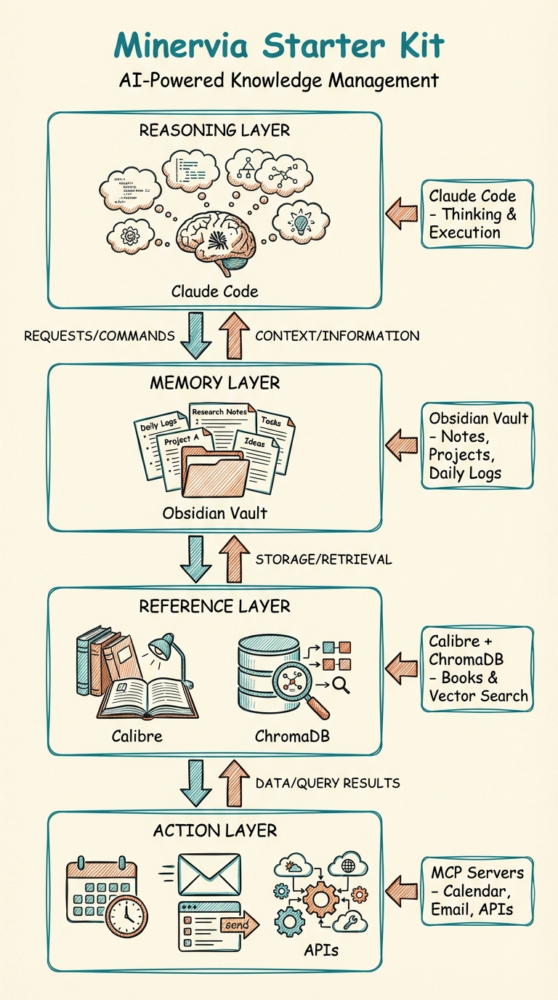
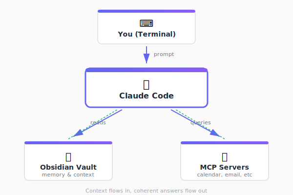
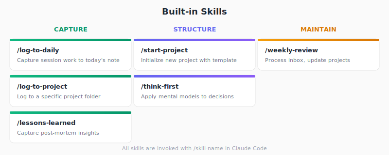

# Minervia Starter Kit

[](https://opensource.org/licenses/MIT)
[](https://github.com/aplaceforallmystuff/minervia-starter-kit/stargazers)
[](https://github.com/aplaceforallmystuff/minervia-starter-kit/issues)
[](https://claude.ai/download)
[](https://obsidian.md)

**Your AI doesn't remember yesterday. Your notes can't execute commands. Standard tools make you choose.**

**Minervia gives you both:** Claude's reasoning + your vault's memory + terminal power.



**You lead. AI assists. Your vault remembers.**

## What Is Minervia?

Minervia configures Claude Code for knowledge work, not just programming. The terminal is the point — no cluttered interfaces, no context-switching between apps, just you and a conversation that can actually *do things*.

## Who This Is For

**✅ You should use Minervia if you:**
- Manage complex projects across multiple files and folders
- Lose context between work sessions (What was I doing yesterday?)
- Have valuable notes but can't surface them when needed
- Want AI that remembers your decisions and preferences
- Need to make your knowledge system actually useful, not just organized

**✅ Perfect for:**
- **Consultants & Freelancers** — Client work, proposals, research synthesis
- **Researchers & Writers** — Literature reviews, drafting, connecting ideas
- **Knowledge Workers** — Project management, decision documentation, continuous learning
- **Technical Professionals** — Documentation, system design, troubleshooting logs

**❌ Not ideal if you:**
- Prefer web-based tools to terminal workflows
- Don't use Obsidian or plain-text notes
- Want fully automated systems without human oversight
- Need mobile-first access (Claude Code is desktop/laptop only)

## The Problem Minervia Solves

Your knowledge is scattered. Notes in different apps, projects in Slack threads, decisions buried in email. Every time you need context, you're searching, scrolling, trying to remember where you saw that thing.

This **cognitive load** is invisible but expensive. You spend mental energy reconstructing what you already knew instead of using that energy to think.

Standard AI chat interfaces can't help with this because they can't:
- Read your files
- Remember what you did yesterday
- Update your notes
- Run scripts on your machine
- Connect to your calendar, email, or local tools

They're stateless. Every conversation starts from zero.

**Minervia treats the terminal as a feature, not a limitation.** Terminal access means Claude can:
- Read your entire vault structure
- Execute commands on your system
- Modify files directly
- Pull context from multiple sources (vault + calendar + email + databases)
- Write back what it learned for future sessions

A "co-operating system" means your AI doesn't just answer questions — it operates *within* your knowledge system, making it smarter with every interaction.

### ✨ Features

- 📝 **Activity Logging** — Capture session work to daily notes automatically
- 🎯 **Project Documentation** — Log progress to specific project folders
- 🔄 **Weekly Reviews** — Process inbox and maintain vault health
- 🧠 **Decision Frameworks** — Apply mental models before big decisions
- 🏗️ **Project Templates** — Initialize new projects with proper structure
- 📖 **Retrospectives** — Learn from wins and failures systematically
- 🔍 **Vault Analysis** — Detect patterns in daily notes, recommend automations
- 🎨 **Aesthetic Definition** — Define brand color palettes and visual styles for image creation

## Early User Feedback

> "I've been using Minervia for 3 months now. The compound effect is real — Claude now knows my projects, my writing style, and my decision patterns. It's like having a research assistant who actually remembers what we discussed last week."
>
> **— Maya Rodriguez, Consulting Partner**

> "The `/think-first` skill changed how I make decisions. Instead of jumping to solutions, I apply frameworks systematically. My decision logs are now a reference library."
>
> **— Early Adopter, Knowledge Management Consultant**

> "Coming from Notion AI and ChatGPT plugins, this is different. Claude can actually *do things* in my vault. It's not just answering questions — it's maintaining my knowledge system."
>
> **— Researcher, switching from web-based tools**

*Want to share your experience? [Open a discussion](https://github.com/aplaceforallmystuff/minervia-starter-kit/discussions) or reach out via [minervia.co](https://minervia.co)*

## How the Four Pillars Work Together

Minervia isn't a single tool — it's four components that create something greater than their sum:

### 1. Obsidian (Your Memory)

**What it is:** Free note-taking app that stores everything as plain text Markdown files on your machine.

**Why it matters:** Your knowledge lives in files you control. No cloud lock-in, no vendor API limits, no subscription. When you write a note, it's yours forever. Claude reads these files directly from your filesystem.

**Get it:** [obsidian.md/download](https://obsidian.md/download)

### 2. Claude Code (The Reasoning)

**What it is:** Claude, but running in your terminal instead of a chat window.

**Why it matters:** Terminal access means Claude can read files, execute commands, and make real changes to your system. It's not just answering questions — it's *working*. It can search your vault, compile research, create files, run scripts, and update your notes based on what it finds.

**Requirements:**
- Claude Pro ($20/month) or Claude Max ($200/month)
- Included with your subscription — no additional cost

**Get it:** [claude.ai/download](https://claude.ai/download) or `npm install -g @anthropic-ai/claude-code`

### 3. MCP Servers (The Bridges)

**What it is:** Model Context Protocol — an open standard that lets Claude connect to external tools and services.

**Why it matters:** MCP servers run locally on your machine. Claude talks to your calendar, email, databases, and APIs through these servers. No cloud processing of your data. Everything stays on your laptop.

**How it works:** Each server is composable. Need calendar access? Add one server. Need to query your database? Add another. Remove what you don't use.

**Examples:**
- Calendar integration (events, scheduling, reminders)
- Email (read, send, search, organize)
- Task management systems
- Custom APIs and webhooks
- Local databases (SQLite, PostgreSQL)

**The key:** Everything runs local. Your data never leaves your machine unless you explicitly send it somewhere.

### 4. Skills & Commands (The Automation)

**What it is:** Reusable procedures Claude follows when you invoke them.

**Why it matters:** You don't have to explain the same workflow every time. `/log-to-daily` captures your session work. `/weekly-review` processes your inbox. You define the procedure once, use it forever.

**Layers of control:**

| Level | Example | You Control |
|-------|---------|-------------|
| Manual | You type, Claude responds | Every response |
| One-click | `/log-to-daily` | When to invoke |
| Delegated | "Handle this" (multi-step) | The outcome |
| Reactive | Claude suggests actions | Whether to accept |
| Scheduled | Background jobs | The schedule |

Most people start manual and add automation as trust builds.

### How They Connect

<p align="center">
  
</p>

Claude reads your vault, pulls from MCP servers, reasons about it all, and gives you one coherent answer.

## Quick Start

### 1. Prerequisites

| Requirement | Cost | Notes |
|-------------|------|-------|
| [Obsidian](https://obsidian.md/download) | **Free** | Download for macOS, Windows, or Linux. Personal use is free forever. |
| [Claude Code](https://claude.ai/download) | **Paid** | Requires a Claude subscription ($20/month Pro or $200/month Max). Install via `npm install -g @anthropic-ai/claude-code` or download directly. |

> **💡 Already have Claude Pro/Max?** Claude Code is included with your subscription — no additional cost.

### 2. Install

```bash
# Clone the starter kit
git clone https://github.com/aplaceforallmystuff/minervia-starter-kit.git

# Navigate to your Obsidian vault
cd /path/to/your/obsidian/vault

# Run the installer from the starter kit
/path/to/minervia-starter-kit/install.sh
```

Or copy manually:
```bash
# Copy skills to your Claude Code skills directory
cp -r minervia-starter-kit/skills/* ~/.claude/skills/

# Copy CLAUDE.md template to your vault
cp minervia-starter-kit/CLAUDE.md /path/to/your/vault/
```

### 3. Configure

Edit `CLAUDE.md` in your vault to match your folder structure:

```yaml
vault:
  daily_notes: "00 Daily/YYYY/"    # Where daily notes live
  inbox: "01 Inbox/"               # Quick capture location
  projects: "02 Projects/"         # Active projects
  # ... adjust to your structure
```

### 4. Use

```bash
cd /path/to/your/vault
claude
```

Then: describe what you're working on. Claude reads your vault, understands your context, and helps you think.

## Troubleshooting

### Pre-Flight Checklist

Before reporting issues, verify these prerequisites:

| Check | Command | Expected Result |
|-------|---------|-----------------|
| Obsidian installed | Open Obsidian app | Vault loads without errors |
| Claude Code installed | `claude --version` | Returns version number |
| Node.js available | `node --version` | v18 or higher |
| Skills directory exists | `ls ~/.claude/skills/` | Directory exists (may be empty) |
| Vault has CLAUDE.md | `ls /path/to/vault/CLAUDE.md` | File exists |

### Common Installation Errors

**Error: `install.sh: command not found`**
```bash
# Make the script executable first
chmod +x /path/to/minervia-starter-kit/install.sh
./install.sh
```

**Error: `CLAUDE.md already exists`**

The installer won't overwrite existing CLAUDE.md files. This is intentional to protect your configuration.

**Solution:** Either:
- Manually merge content from `minervia-starter-kit/CLAUDE.md` into your existing file
- Rename your existing file (`mv CLAUDE.md CLAUDE.md.backup`) and run installer again
- Skip the CLAUDE.md step and just copy skills: `cp -r minervia-starter-kit/skills/* ~/.claude/skills/`

**Error: `Permission denied` when copying skills**
```bash
# Create the skills directory if it doesn't exist
mkdir -p ~/.claude/skills/

# Then retry the installation
./install.sh
```

### Verifying Installation Succeeded

After running the installer, verify skills are available:

```bash
# Check that skills were copied
ls ~/.claude/skills/

# Expected output:
# log-to-daily/
# log-to-project/
# lessons-learned/
# start-project/
# weekly-review/
# think-first/
```

Start Claude in your vault and test:
```bash
cd /path/to/your/vault
claude
> "List available skills"
```

Claude should recognize and list the installed skills.

### Path Validation (macOS/Linux)

If Claude can't find your vault folders:

```bash
# Test the path exists
ls "/path/to/your/vault/00 Daily/"

# If path has spaces, ensure CLAUDE.md uses quotes:
daily_notes: "00 Daily/YYYY/"  # Correct
daily_notes: 00 Daily/YYYY/    # Wrong - will fail
```

### Windows (WSL) Specific Issues

**Vault on Windows filesystem (C: drive):**

WSL can access Windows files at `/mnt/c/`:
```bash
# If your vault is at C:\Users\YourName\Documents\Vault
cd /mnt/c/Users/YourName/Documents/Vault
```

**Line ending issues:**

If skills seem corrupted or don't work:
```bash
# Convert line endings (requires dos2unix)
find ~/.claude/skills/ -name "*.md" -exec dos2unix {} \;
```

### Still Having Issues?

1. **Check Claude Code is working:** Run `claude` in any directory - if that fails, reinstall Claude Code
2. **Verify file permissions:** Skills must be readable: `chmod -R 644 ~/.claude/skills/`
3. **Test with minimal vault:** Create new empty vault, copy just CLAUDE.md, test there
4. **Check logs:** Claude Code logs errors - check terminal output for specific error messages

## Your First Conversation

Here's what an actual session looks like — not hypothetical, but the real workflow:

```
You: "I'm working on a presentation about AI adoption.
What notes do I already have about this?"

Claude: [Searches vault]
"I found 3 relevant notes:
- 03 Areas/AI Strategy/AI Adoption Patterns.md (2,400 words)
- 02 Projects/Client Work/Acme Corp AI Assessment.md (framework examples)
- 04 Resources/Research/McKinsey AI Report - Summary.md

Want me to pull key points from each?"

You: "Yes, and create a new project for this presentation."

Claude: "I'll create the project structure and compile your existing research.
Should I use /start-project to set this up properly?"

You: "Yes"

Claude: [Invokes /start-project skill]
[Creates folder: 02 Projects/AI Adoption Presentation/]
[Generates PROJECT.md with completion criteria]
[Creates initial outline from your existing notes]
[Compiles research summary]

"Project created at 02 Projects/AI Adoption Presentation/.
I've compiled key points from your three notes into Research-Summary.md.

The outline draft is in Outline-Draft.md. Based on your existing
notes, I suggest structuring it as:
1. The adoption gap (from Acme case study)
2. Common failure patterns (from AI Adoption Patterns)
3. Framework for systematic adoption (from McKinsey summary)

Want me to draft the introduction section?"
```

**What just happened:**

1. You asked a question
2. Claude searched your entire vault for relevant content
3. You gave a follow-up instruction
4. Claude invoked a skill to create project structure
5. Claude compiled research from multiple notes
6. Claude suggested next steps based on what it found

**The key difference from chat interfaces:**

- Claude read 3 different files across different folders
- Claude created new files in your vault
- Claude structured the project using your methodology
- Claude can pick this up tomorrow because it's all in your vault

That's the loop. You lead, Claude assists, the vault remembers.

## The Compound Effect

Here's what makes this different from standard AI chat interfaces — context that actually builds over time:

### Session 1 (Day 1)
- You ask Claude to help draft an article about AI implementation
- Claude reads your notes, drafts content based on what it finds
- You invoke `/log-to-daily` to capture what you worked on
- Today's daily note records: "Drafted AI implementation article, pulled research from 4 existing notes"

### Session 2 (Day 2)
- You open Claude in the same vault
- Claude can read yesterday's daily note (it's just a file in your vault)
- Claude knows what you were working on
- You say: "Continue with that article"
- Claude picks up exactly where you left off — no need to re-explain context

### Session 3 (Day 3)
- You say: "What should I work on today?"
- Claude reads the last 3 daily notes
- Claude sees: article draft (Day 1), client meeting notes (Day 2), pending outline review
- Claude suggests: "You mentioned wanting to review the article outline before the client meeting on Friday. Should we tackle that now?"

### Session 10 (Week 2)
- Claude has read weeks of your daily notes
- It knows your active projects, your working patterns, your writing style
- It spots connections: "The research you compiled for the AI article overlaps with what you need for the client proposal. Want me to adapt it?"
- It remembers what worked: "Last time you used the PAST framework for this type of analysis — should I structure it the same way?"

**This is continuous context** — the thing standard AI loses between conversations.

### Why It Works

**Standard AI chat:**
- Every conversation starts from zero
- You repeat context every time
- No memory of what you did yesterday
- Can't read your files or notes

**Minervia with vault context:**
- Your vault is Claude's memory
- Daily notes create continuity between sessions
- Claude reads what happened before
- Context accumulates instead of resetting

The more you use it, the smarter it gets — not because Claude learns, but because your vault grows richer with context.

## Engineering Principles

Minervia is designed around principles that make productivity systems actually work:

| Principle | How Minervia Applies It |
|-----------|------------------------|
| **One reliable behavior** | Capture everything, let skills do the organizing |
| **Separate memory/compute/interface** | Vault (memory), Claude (compute), CLI (interface) |
| **Build trust mechanisms** | Skills log what they do; you can see what changed |
| **Default to safe behavior** | Ask when uncertain, don't guess |
| **Small, frequent outputs** | Daily notes, project logs, not giant reports |
| **Next action, not intention** | Projects track executable next actions |
| **Route, don't organize** | Inbox-triage classifies; you confirm |
| **Design for restart** | Miss a week? Just restart. No cleanup required |
| **Core loop, then modules** | Start with 6 skills, add more as needed |

These aren't arbitrary choices. Systems fail when they require too many decisions at the wrong moments. Minervia pushes those decisions to Claude while keeping you in control.

## When to Use Each Skill

<p align="center">
  
</p>

Skills install to `~/.claude/skills/` and work in any vault. Here's when and how to use them:

### `/log-to-daily` — Capture Session Work

**Use when:** Ending a work session, finishing a conversation, or completing a task.

**What it does:**
- Appends session summary to today's daily note
- Records what you worked on, decisions made, files created
- Creates continuity for tomorrow's session

**Example invocation:**
```
You: "I finished the client proposal draft and updated the project timeline."

Claude: "Should I use /log-to-daily to capture that?"

You: "/log-to-daily"

Claude: [Appends to 00 Daily/2026/20260104.md]
"Logged to today's daily note:
- Completed client proposal draft (ProjectX/proposal-v1.md)
- Updated project timeline with adjusted milestones
- Next: Get feedback from team before Friday meeting"
```

**What gets created:** Entry in your daily note that tomorrow's Claude can read.

---

### `/log-to-project` — Document Project Progress

**Use when:** Working on a specific project and want to maintain project-level documentation.

**What it does:**
- Logs work to the project's folder (not daily note)
- Creates/updates project changelog or session notes
- Keeps project history in one place

**Example invocation:**
```
You: "/log-to-project ProjectX"

Claude: "What should I document about today's work on ProjectX?"

You: "Completed wireframes for dashboard, decided on PostgreSQL for data layer"

Claude: [Creates/updates 02 Projects/ProjectX/Session-Log.md]
"Logged to ProjectX:
- Completed wireframes (see Wireframes-v1.fig)
- Database decision: PostgreSQL (better JSON support than MySQL)
- Outstanding: Need to finalize API schema before implementation"
```

**Skill combinations:** Often used with `/log-to-daily` — log to project for project history, log to daily for personal timeline.

---

### `/start-project` — Initialize New Projects

**Use when:** Beginning any new project, client work, or initiative.

**What it does:**
- Creates project folder structure
- Generates PROJECT.md with completion criteria
- Sets up initial files (README, tasks list, etc.)

**Example invocation:**
```
You: "/start-project"

Claude: "What's the project name?"

You: "AI Implementation Guide"

Claude: [Creates 02 Projects/AI Implementation Guide/]
[Creates PROJECT.md with fields for:
 - Completion criteria
 - Success metrics
 - Timeline
 - Resources]

"Project initialized at 02 Projects/AI Implementation Guide/.
What are the completion criteria for this project?"
```

**What gets created:**
- Project folder
- PROJECT.md template
- Optional: Tasks.md, Resources.md, Notes.md

---

### `/weekly-review` — Vault Maintenance

**Use when:** Weekly (typically Sunday evening or Monday morning).

**What it does:**
- Processes all items in Inbox folder
- Sorts to appropriate PARA locations
- Reviews active projects
- Archives completed work
- Surfaces items needing attention

**Example invocation:**
```
You: "/weekly-review"

Claude: [Scans 01 Inbox/]
"Found 8 items in inbox:
- 3 quick capture notes → Will sort to appropriate areas
- 2 article drafts → Move to Resources/Research?
- 1 project idea → Move to Projects/_Incubation?
- 2 reference PDFs → Move to Resources/References?"

[Then walks through each item, asks for sorting decision]

"Review complete:
- Inbox cleared: 8 → 0 items
- 2 projects marked completed → Moved to Archive
- 3 stale tasks removed
- Next review: Sunday, Jan 11"
```

**Frequency:** Weekly. Keeps vault healthy and surfaceable.

---

### `/think-first` — Apply Mental Models

**Use when:** Facing a significant decision, choosing between options, or solving a complex problem.

**What it does:**
- Walks you through structured thinking frameworks
- Prevents rushing into decisions without analysis
- Documents reasoning for future reference

**Available models:**
- `first-principles` — Break problem down to fundamental truths
- `inversion` — What would guarantee failure? Avoid that.
- `second-order` — What happens after what happens?
- `opportunity-cost` — What are you NOT doing by choosing this?
- `pareto` — What 20% creates 80% of the value?

**Example invocation:**
```
You: "/think-first opportunity-cost"

Claude: "What decision are you evaluating?"

You: "Should I build a custom CRM or use an off-the-shelf tool?"

Claude: "Let's think through opportunity costs:

If you build custom:
- Opportunity cost: ~3 months development time
- What else could you do with 3 months?
  - Launch 2 other products
  - Acquire 50+ customers with existing tools
  - Build revenue before infrastructure

If you use off-the-shelf:
- Opportunity cost: ~$200/month subscription
- What else could $200/month buy?
  - Minimal — less than 1 hour of your time

The opportunity cost of building is your time (high value).
The opportunity cost of buying is money (low value).

Recommendation: Buy the tool, focus your time on revenue."
```

**What gets created:** Decision log with reasoning, saved to vault for future reference.

---

### `/lessons-learned` — Structured Retrospectives

**Use when:** After completing a project, experiencing a failure, or having a breakthrough.

**What it does:**
- Runs structured retrospective interview
- Captures what worked, what didn't, why
- Extracts reusable insights
- Updates your knowledge base

**Example invocation:**
```
You: "The client project went way over budget and missed the deadline."

Claude: "Should I run /lessons-learned to analyze what happened?"

You: "/lessons-learned"

Claude: [Structured interview]
"What was the intended outcome?"
"What was the actual outcome?"
"What caused the gap?"
"What would you do differently?"
"What worked well despite the issues?"

[Creates lessons-learned-client-project-YYYY-MM-DD.md]
[Extracts patterns]
[Updates processes to prevent recurrence]

"I've documented 3 systematic issues:
1. Scope creep from unclear requirements → Added requirement template
2. No buffer time in estimates → Updated estimation checklist
3. Communication gaps → Added weekly sync requirement

Want me to update your project template with these fixes?"
```

**What gets created:**
- Retrospective document
- Process improvements
- Updated templates/checklists

## The Compound Loop

```
Work → Conversation → Skill invocation → Vault update → Informed future work
```

Every session that updates your vault makes the next session smarter. This is continuous context — the thing standard AI loses between conversations.

## Workflow Examples

### Starting Your Day

```bash
cd ~/vault && claude
> "What was I working on yesterday? What's on my calendar today?"
```

Claude searches your daily notes, checks your calendar (if configured), and helps you plan.

### Making a Decision

```
> /think-first first-principles
> "Should I build this feature myself or use a third-party service?"
```

The skill walks you through structured thinking before you commit.

### Ending a Session

```
> /log-to-daily
```

Captures what happened — tomorrow's Claude knows what you did today.

### Weekly Maintenance

```
> /weekly-review
```

Processes inbox, updates project statuses, maintains vault health.

## Vault Agnostic

Minervia works with any Obsidian organization system:

- **PARA** (Projects, Areas, Resources, Archive)
- **Zettelkasten** (atomic notes with links)
- **Date-based** (daily notes as primary structure)
- **Custom** (whatever works for you)

Just configure the paths in CLAUDE.md.

## Common Questions

### Do I need to know how to code?

**No.** You need to be comfortable typing commands in a terminal, but you don't need to write code.

The skills are pre-written. You just invoke them (`/log-to-daily`, `/weekly-review`, etc.).

**What you need:**
- Ability to navigate folders in terminal (`cd /path/to/folder`)
- Ability to run commands (`./install.sh`, `claude`)
- Comfort editing a text file (CLAUDE.md configuration)

**What you don't need:**
- Programming experience
- Knowledge of Node.js, npm, or JavaScript
- Understanding of how MCP servers work internally

Think of it like using Obsidian itself — you don't need to know how it's built, you just use it.

---

### Is my data safe?

**Yes.** Your vault files stay on your machine. MCP servers run locally.

**What stays local:**
- Your entire Obsidian vault (Claude reads it locally)
- MCP server data (calendar, email, database connections)
- Skills and configuration files

**What goes to Anthropic:**
- The specific prompts you send to Claude
- The content Claude needs to respond (context you reference)
- Same as using Claude chat interface — no difference

**Key point:** Claude Code running locally is just as safe as Claude chat. The only difference is local file access, which means *less* data leaves your machine (Claude reads files locally instead of you copying/pasting into chat).

---

### What if I don't use PARA methodology?

**The system works with any organization method.** Just configure the paths in CLAUDE.md to match your structure.

**Examples:**

**Zettelkasten users:**
```yaml
vault:
  daily_notes: "Daily/"
  inbox: "Inbox/"
  zettelkasten: "Zettels/"
```

**Simple date-based:**
```yaml
vault:
  daily_notes: "Journal/"
  notes: "Notes/"
  projects: "Work/"
```

**Custom structure:**
```yaml
vault:
  personal: "Personal/"
  work: "Work/"
  reference: "Reference/"
  archive: "Archive/"
```

The skills adapt to your structure. As long as Claude knows where things are, it works.

---

### Can I use this on Windows?

**Yes, via WSL (Windows Subsystem for Linux).**

Claude Code runs on:
- macOS (native)
- Linux (native)
- Windows via WSL

**Windows setup:**
1. Install WSL: https://docs.microsoft.com/en-us/windows/wsl/install
2. Install Node.js in WSL: `curl -fsSL https://deb.nodesource.com/setup_20.x | sudo -E bash -`
3. Install Claude Code: `npm install -g @anthropic-ai/claude-code`
4. Access your vault: If vault is on C: drive, it's available at `/mnt/c/Users/YourName/...`

See [Troubleshooting](#troubleshooting) section for WSL-specific issues.

---

### How much does this cost?

| Component | Cost |
|-----------|------|
| Obsidian | **Free** (personal use) |
| Minervia Skills | **Free** (MIT license, open source) |
| Claude Code | **$20/month** (Claude Pro) or **$200/month** (Claude Max) |
| MCP Servers | **Free** (most are open source) |

**Total: $20-200/month** (just your Claude subscription — everything else is free).

**Claude Code is included with your Claude Pro/Max subscription** — no additional cost beyond what you already pay for Claude.

---

### What if I don't have MCP servers configured yet?

**You don't need them to start.** Minervia works fine with just:
- Obsidian vault
- Claude Code
- The 6 included skills

MCP servers are *optional extensions*. You add them when you need specific integrations:
- Calendar access → Add calendar MCP server
- Email access → Add email MCP server
- Database queries → Add database MCP server

Start simple. Add complexity when you hit friction.

---

### Can I use this with an existing vault?

**Yes.** The installer is designed for existing vaults.

**What happens:**
1. Skills install to `~/.claude/skills/` (global, works in any vault)
2. CLAUDE.md template copies to your vault root (or you manually configure it)
3. Your existing files and structure remain untouched

You can test Minervia in an existing vault without risk. If you don't like it, just delete CLAUDE.md.

---

### What's the learning curve?

**Week 1:** Basic usage (30 minutes)
- Install components
- Have first conversation
- Try `/log-to-daily` once

**Week 2:** Skill adoption (2-3 hours)
- Use `/log-to-daily` at end of each session
- Try `/start-project` for one project
- Build daily note habit

**Week 3:** Compound effect visible (ongoing)
- Claude references your daily notes
- Context builds between sessions
- System starts feeling natural

**Month 2+:** Advanced usage (optional)
- Add MCP servers for specific integrations
- Create custom skills
- Build automation workflows

Most value comes in weeks 2-4 as context compounds. The system gets more useful the more you use it.

---

### How does this compare to standard Claude chat?

| Feature | Claude Chat | Minervia (Claude Code) |
|---------|-------------|------------------------|
| **File access** | No — copy/paste only | Yes — reads vault directly |
| **Remembers yesterday** | No — fresh every time | Yes — reads daily notes |
| **Updates notes** | No — can't modify files | Yes — writes to vault |
| **Runs commands** | No — can't execute scripts | Yes — full terminal access |
| **MCP integration** | Desktop app only | Yes — full MCP support |
| **Continuous context** | No — resets per chat | Yes — vault is memory |
| **Cost** | $20/month | $20/month (same sub) |

The chat interface is great for quick questions. Minervia is for *working* — managing projects, building context, maintaining knowledge systems.

## First Week Guide

This is how to actually use Minervia in your first week — not theory, just what to do each day.

### Day 1: Install and First Conversation

**Time: ~30 minutes**

1. **Install prerequisites** (if not already done):
   - Download Obsidian: https://obsidian.md/download
   - Install Claude Code: `npm install -g @anthropic-ai/claude-code`

2. **Clone and install Minervia:**
   ```bash
   git clone https://github.com/aplaceforallmystuff/minervia-starter-kit.git
   cd /path/to/your/vault
   /path/to/minervia-starter-kit/install.sh
   ```

3. **Have your first conversation:**
   ```bash
   cd /path/to/your/vault
   claude
   ```

   Then just describe what you're working on:
   ```
   "I'm working on a project about X. What notes do I already have about this topic?"
   ```

4. **End the session:**
   ```
   /log-to-daily
   ```

**Success criteria:** You had a conversation, Claude searched your vault, you invoked one skill.

---

### Day 2-3: Build Daily Note Habit

**Time: ~15 minutes per day**

Each day:
1. Open Claude in your vault: `cd /path/to/vault && claude`
2. Have a work conversation (ask questions, get help thinking)
3. End with `/log-to-daily`

**Try asking:**
- "What was I working on yesterday?"
- "Summarize my daily notes from this week"
- "What patterns do you see in my daily notes?"

By Day 3, Claude can reference 3 days of context. You'll notice it picking up threads from previous conversations.

**Success criteria:** 3 daily notes with logged sessions.

---

### Day 4-5: Try Specific Skills

Pick one project to work on and test these skills:

**Start a new project:**
```
/start-project
```

**Log work to that project:**
```
/log-to-project [project name]
```

**Make a decision using a framework:**
```
/think-first opportunity-cost
```

**Try this:** Work on the same project both days. Log to the project each time. See how project context builds separately from daily notes.

**Success criteria:** One project with 2 logged sessions, one decision documented.

---

### Day 6-7: Review and Reflect

**Review your week:**
1. Read your 6 daily notes — see the continuity
2. Look at the project you worked on — see the project history
3. Notice: Claude now knows what happened this week

**Try this conversation:**
```
"Summarize what I worked on this week. What should I focus on next week?"
```

Claude will synthesize across all your daily notes and suggest what needs attention.

**Optional: Run your first `/weekly-review`:**
```
/weekly-review
```

This processes your inbox and surfaces items needing attention.

**Success criteria:** You understand how context compounds. Claude references past work without prompting.

---

### Week 2+: Add What Helps

Now that you have the basics, add complexity only where you feel friction:

**If you often check your calendar:**
→ Add calendar MCP server

**If you process email:**
→ Add email MCP server

**If you have repetitive tasks:**
→ Create a custom skill

**If you need to make decisions often:**
→ Use `/think-first` regularly

**If projects get messy:**
→ Use `/log-to-project` consistently

The system improves as you use it. Don't add everything at once — add what solves actual problems.

## Extending Minervia

### Add MCP Servers

Connect Claude to external services:

```bash
# Example: Add calendar integration
claude mcp add fantastical
```

### Create Custom Skills

Add skills to `~/.claude/skills/your-skill/SKILL.md`:

```markdown
# Your Skill

Instructions for Claude when this skill is invoked.

## use_when
User asks to do [specific task]

## process
1. Step one
2. Step two
3. Step three
```

### Create Custom Agents

Agents are more sophisticated than skills — they can orchestrate multiple other agents, apply mental models, and handle complex multi-step workflows.

Add agents to `.claude/agents/your-agent.md`:

```markdown
---
name: your-agent
description: Brief description of what this agent does
tools: Read, Write, Grep, Glob, Bash, Task
model: sonnet
---

<role>
What this agent does and how it operates.
</role>

<workflow>
Step-by-step process the agent follows.
</workflow>
```

**Example: Workflow Coordinator**

The starter kit includes a `workflow-coordinator` agent that demonstrates multi-agent orchestration patterns:

- **Location:** `.claude/agents/workflow-coordinator.md`
- **Purpose:** Analyze requests → decompose into tasks → route to specialized agents → synthesize results
- **Key Feature:** Applies mental models via `think-first` skill for significant decisions

**Example: Vault Analyst**

The starter kit also includes a `vault-analyst` agent that analyzes your daily notes to surface patterns and automation opportunities:

- **Location:** `.claude/agents/vault-analyst.md`
- **Purpose:** Scan daily notes → detect behavioral patterns → recommend skills and agents
- **Key Feature:** Identifies repetitive tasks and workflows that could be automated

Invoke with: "analyze my vault", "what patterns do you see?", or "suggest automations"

**Example: Aesthetic Definer**

The starter kit also includes an `aesthetic-definer` agent that helps users create their own visual brand identity:

- **Location:** `.claude/agents/aesthetic-definer.md`
- **Purpose:** Interview user about brand personality → guide color selection → output aesthetic.md
- **Key Feature:** Generates a ready-to-use aesthetic file compatible with image generation skills

Invoke with: "define my aesthetic", "create brand palette", or "set up my visual style"

Agents use the Task tool to delegate work. They don't do specialized work themselves — they coordinate others who do.

## Philosophy

- **Terminal is clarity** — fewer distractions, more focus
- **You lead** — Claude assists, you decide
- **Context compounds** — every session makes the next better
- **Integration over capability** — connecting tools beats isolated features

## Requirements

| Platform | Status |
|----------|--------|
| macOS | ✅ Fully supported |
| Linux | ✅ Fully supported |
| Windows (WSL) | ✅ Supported via WSL |

**Software:**
- [Obsidian](https://obsidian.md/download) — Free, open-source note-taking app
- [Claude Code](https://claude.ai/download) — Requires Claude Pro ($20/mo) or Max ($200/mo) subscription

## License

MIT

---

*Start with a vault and a conversation. Add complexity when you need it — not before.*

Learn more at [minervia.co](https://minervia.co)
